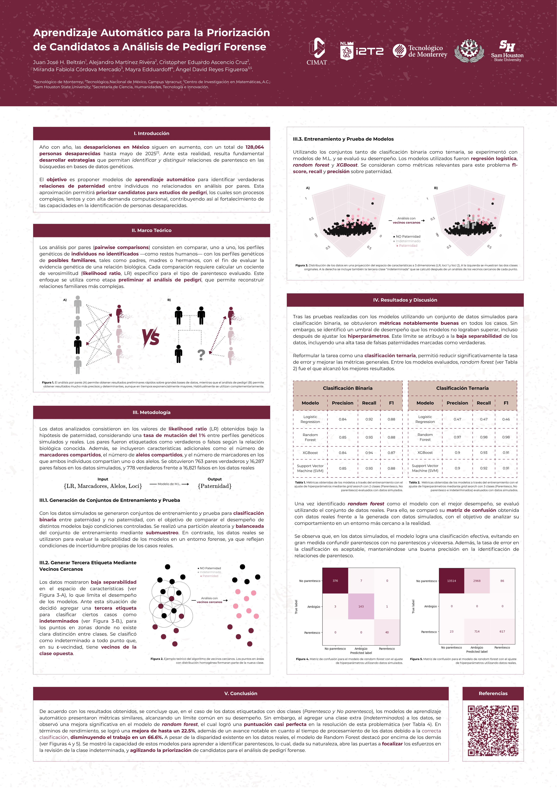

# Aprendizaje Automático para la Priorización de Candidatos a Análisis de Pedigrí Forense

## Introducción

 Año con año, las desapariciones en México siguen en aumento, con un total de 128,064 personas desaparecidas hasta mayo de 2025. Ante esta realidad, resulta fundamental desarrollar estrategias que permitan identificar y distinguir relaciones de parentesco en las búsquedas en bases de datos genéticos. 

 El objetivo es proponer modelos de aprendizaje automático para identificar verdaderas relaciones de paternidad entre individuos no relacionados en análisis por pares. Esta aproximación permitirá priorizar candidatos para estudios de pedigrí, los cuales son procesos complejos, lentos y con alta demanda computacional, contribuyendo así al fortalecimiento de las capacidades en la identificación de personas desaparecidas. 

## Póster

    

