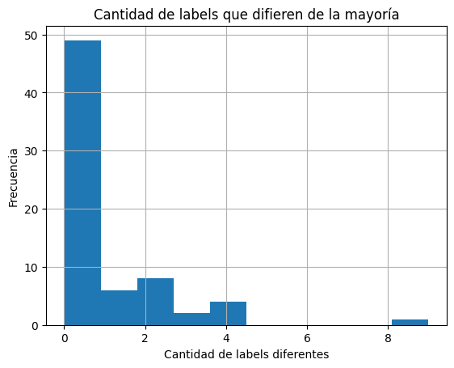
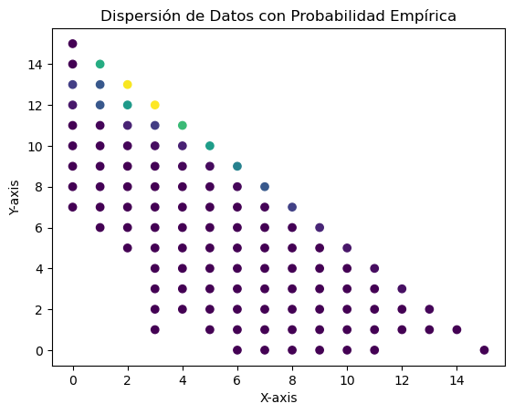
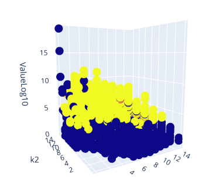
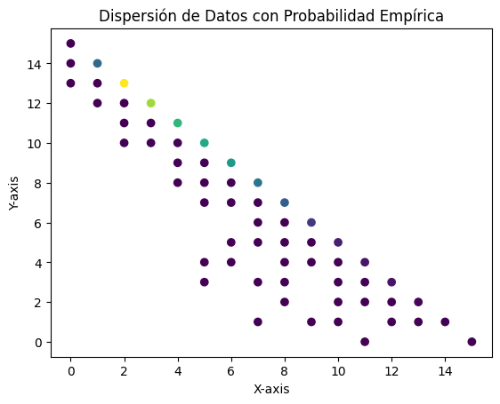
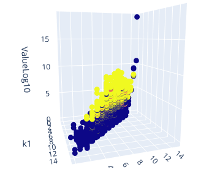
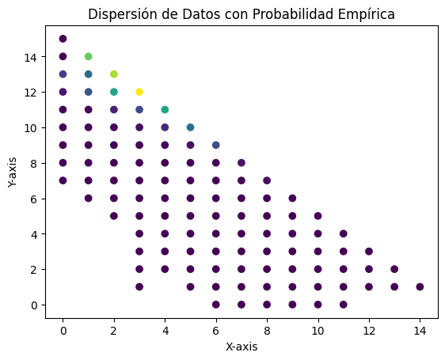
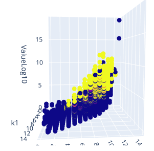

# Algunos Problemas en la Base de Datos

## Desbalance de Clases

## Datos Contradictorios (Learning Conflicts)

En la base de datos completa existen algunos datos contradictorios.

Estos permanecen al hacer la partición. Por ejemplo, las contradicciones en los datos de prueba (entre `k0`, `k1`, `k2` y `value`) se ven de la siguiente forma:

Condensando los datos repetidos utilizando su probabilidad empírica, se obtiene la siguiente proyección a `k1` y `k2`.

De forma similar a lo anterior ahora los datos se proyectan a `k1`, `k2`, `ValueLog10`.

### Dispersión de Datos en Paternidad

### Dispersión de Datos en Hermandad

