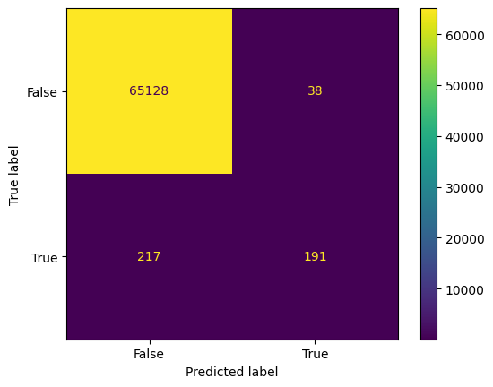
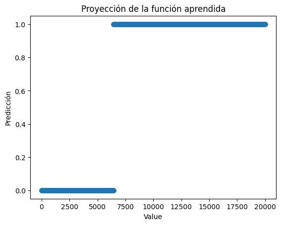
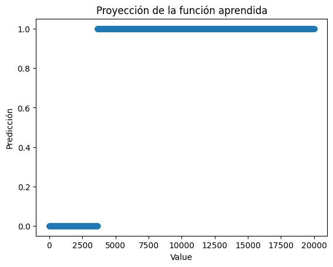

# Notas Sobre el Desempeño de XGBoost Classifier

El propósito principal de estos experimentos es comprobar o desmentir la siguiente hipótesis.

> Considerar otras características más allá del LR, junto a un modelo más sofisticado que un umbral, permite mejorar la calidad de las predicciones de parentesco.


## Baseline

Para tener un punto de partida y de comparación se entrenó un modelo XGBoost vanilla únicamente con los datos de value. Los resultados de este experimento se muestran a continuación.

```
    precision    recall  f1-score   support

NO Parentesco       1.00      1.00      1.00     65166
   Parentesco       0.83      0.47      0.60       408

     accuracy                           1.00     65574
    macro avg       0.92      0.73      0.80     65574
 weighted avg       1.00      1.00      1.00     65574
```



La función aprendida, en efecto, es un umbral óptimo.



## Entrenando con Características Adicionales

Entrenando un XGBoost vanilla con el set `["Shared_Markers", "k0", "k1", "k2", "Share_allele", "Value"]`. Los resultados se muestran a continuación.

```
precision    recall  f1-score   support

NO Parentesco       1.00      1.00      1.00     65166
   Parentesco       0.87      0.47      0.61       408

     accuracy                           1.00     65574
    macro avg       0.93      0.74      0.81     65574
 weighted avg       1.00      1.00      1.00     65574
```


Un ejemplo de la función aprendida por este modelo se muestra a continuación.



### Optimizando Hiperparámetros con Grid Search