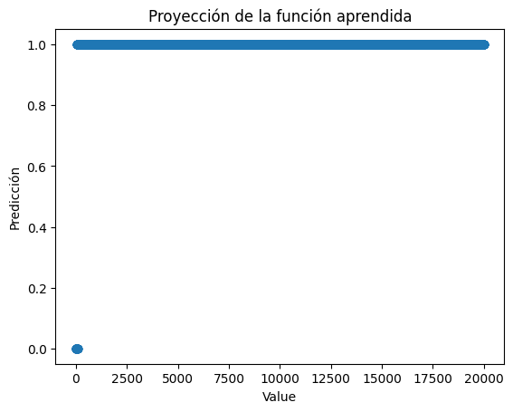
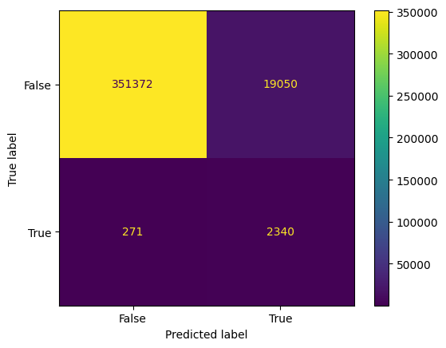
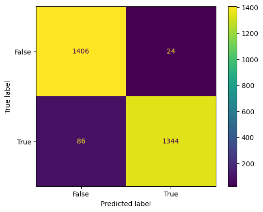
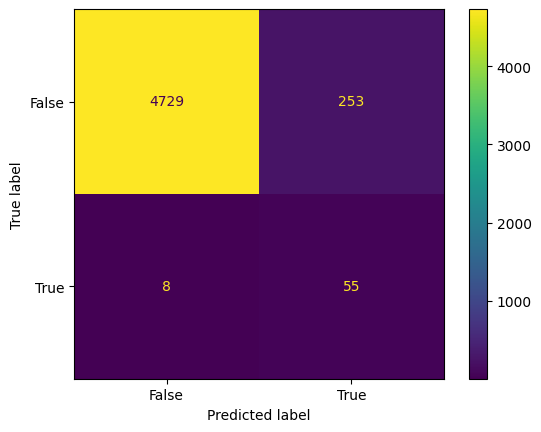

# Notas Sobre el Desempeño de XGBoost Classifier

El propósito principal de estos experimentos es comprobar o desmentir la siguiente hipótesis.

> Considerar otras características más allá del LR, junto a un modelo más sofisticado que un umbral, permite mejorar la calidad de las predicciones de parentesco.


## Baseline

Para tener un punto de partida y de comparación se entrenó un modelo XGBoost vanilla únicamente con los datos de value. Los resultados de este experimento se muestran a continuación.

```
    precision    recall  f1-score   support

NO Parentesco       1.00      1.00      1.00     65166
   Parentesco       0.83      0.47      0.60       408

     accuracy                           1.00     65574
    macro avg       0.92      0.73      0.80     65574
 weighted avg       1.00      1.00      1.00     65574
```


La función aprendida, en efecto, es un umbral óptimo.


## Entrenando con Características Adicionales

Entrenando un XGBoost vanilla con el set `["Shared_Markers", "k0", "k1", "k2", "Share_allele", "Value"]`. Los resultados se muestran a continuación.

```
precision    recall  f1-score   support

NO Parentesco       1.00      1.00      1.00     65166
   Parentesco       0.87      0.47      0.61       408

     accuracy                           1.00     65574
    macro avg       0.93      0.74      0.81     65574
 weighted avg       1.00      1.00      1.00     65574
```


Algunos ejemplos de proyecciones de la función aprendida por este modelo se muestran a continuación.




### Predicciones con Datos Reales

```
precision    recall  f1-score   support

NO Parentesco       1.00      0.95      0.97    370422
   Parentesco       0.11      0.90      0.19      2611

     accuracy                           0.95    373033
    macro avg       0.55      0.92      0.58    373033
 weighted avg       0.99      0.95      0.97    373033
```



### Optimizando Hiperparámetros con Grid Search

Por cuestiones de tiempo de ejecución no terminó de ejecutarse el grid search exahustivo, pero sí 

## Entrenando con Características Adicionales y Datos Balanceados

Un XGBoost vanilla obtiene ahora las siguientes métricas sobre los **datos de entrenamiento**.

```
precision    recall  f1-score   support

NO Parentesco       0.94      0.98      0.96      1430
   Parentesco       0.98      0.94      0.96      1430

     accuracy                           0.96      2860
    macro avg       0.96      0.96      0.96      2860
 weighted avg       0.96      0.96      0.96      2860
```



Sin embargo, al pasarse a los **datos de prueba** se obtienen las siguientes métricas.

```
precision    recall  f1-score   support

NO Parentesco       1.00      0.95      0.97      4982
   Parentesco       0.18      0.87      0.30        63

     accuracy                           0.95      5045
    macro avg       0.59      0.91      0.63      5045
 weighted avg       0.99      0.95      0.96      5045
```

